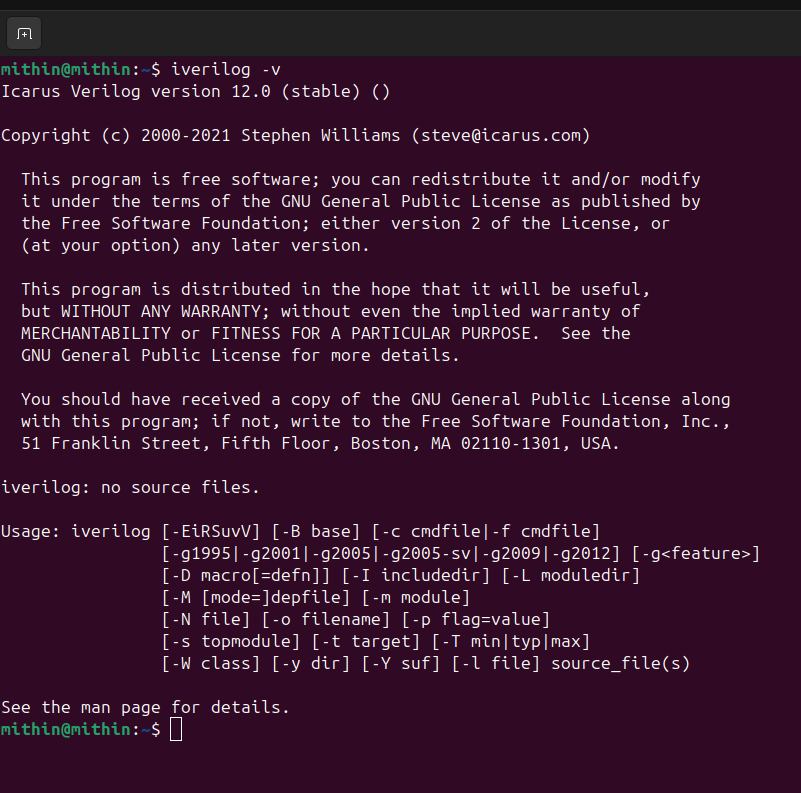
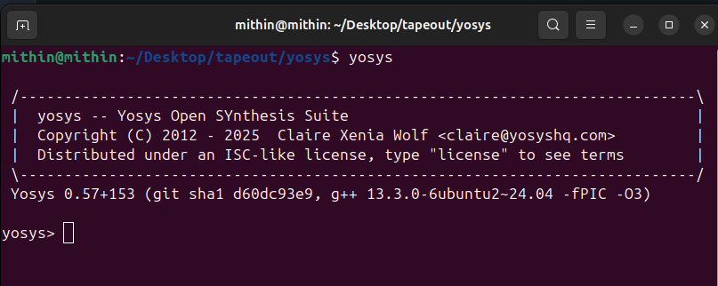
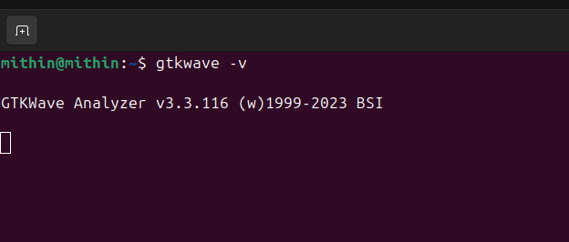

# Week 0 - Tool Installation

## Goal
The goal of this week is to install the necessary tools.

## System Setup
Using dual booted Ubuntu 22.04 LTS instead of VM.

## Tool Installation

### Yosys

```bash
sudo apt-get update
git clone https://github.com/YosysHQ/yosys.git
cd yosys
sudo apt install make
```
*(If make is not installed please install it)*

```bash
sudo apt-get install build-essential clang bison flex \
 libreadline-dev gawk tcl-dev libffi-dev git \
 graphviz xdot pkg-config python3 libboost-system-dev \
 libboost-python-dev libboost-filesystem-dev zlib1g-dev
make config-gcc
make
sudo make install
```



### Iverilog

Steps to install iverilog:

```bash
sudo apt-get update
sudo apt-get install iverilog
```



### GTKWave

Steps to install gtkwave:

```bash
sudo apt-get update
sudo apt install gtkwave
```



### OpenSTA *(not needed for SFAL participants)*

https://github.com/The-OpenROAD-Project/OpenSTA
